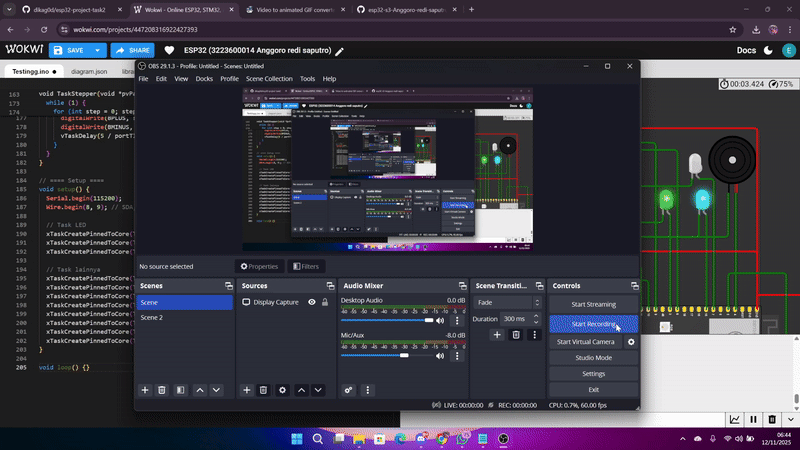

# Percobaan ALL PERIPHERAL – FreeRTOS pada ESP32-S3

## Tujuan
Percobaan ini bertujuan untuk memahami bagaimana **setiap peripheral** pada sistem dapat dijalankan **secara bersamaan** menggunakan *multitasking FreeRTOS* di mikrokontroler **ESP32-S3**.  
Melalui percobaan ini, mahasiswa dapat mempelajari cara kerja sistem multitasking yang sesungguhnya, pembagian beban kerja antar core (Core 0 dan Core 1), serta bagaimana prioritas task memengaruhi performa sistem.

---

## Konfigurasi Komponen
Beberapa komponen digunakan secara bersamaan dalam satu sistem dengan konfigurasi sebagai berikut:

| Komponen       | GPIO | Keterangan |
|----------------|------|------------|
| LED Hijau      | 3    | Output |
| LED Putih      | 7    | Output |
| LED Tosca      | 15   | Output |
| Buzzer         | 4    | Output |
| Button 1       | 19   | Input Pull-Up |
| Button 2       | 21   | Input Pull-Up |
| Potensiometer  | 5    | Analog Input |
| Servo Motor    | 42   | PWM Output |
| Encoder CLK    | 10   | Input |
| Encoder DT     | 11   | Input |
| OLED SDA       | 8    | I2C Data |
| OLED SCL       | 9    | I2C Clock |
| Stepper A-     | 40   | Output |
| Stepper A+     | 39   | Output |
| Stepper B+     | 38   | Output |
| Stepper B-     | 37   | Output |

Seluruh komponen dijalankan secara independen melalui task masing-masing dan bekerja paralel di dua core prosesor.

---

## Alur Program
1. **Inisialisasi Komponen dan Task**
   Semua komponen diinisialisasi di fungsi `setup()`.  
   Setiap task dibuat menggunakan fungsi `xTaskCreatePinnedToCore()` untuk menentukan core tempat task akan dijalankan (Core 0 atau Core 1).

2. **Task LED**
   Tiga buah LED dikendalikan dengan kecepatan kedip berbeda:
   - LED Hijau: 500 ms  
   - LED Putih: 1000 ms  
   - LED Tosca: 200 ms  
   Task ini menunjukkan bagaimana beberapa output dapat bekerja bersamaan menggunakan FreeRTOS.

3. **Task Buzzer**
   Buzzer aktif selama 200 ms dan diam 1800 ms secara periodik.  
   Task ini menggunakan `vTaskDelay()` agar tidak menghambat task lain yang berjalan di core yang sama.

4. **Task Button**
   Dua tombol membaca input menggunakan mode `INPUT_PULLUP`.  
   Saat ditekan, sistem mencetak status tombol dan core yang menanganinya melalui `Serial.printf()`.

5. **Task Potensiometer**
   Task ini membaca nilai analog dari pin 5 dan menampilkan hasilnya di Serial Monitor serta OLED.  
   Pembacaan dilakukan setiap 500 ms agar stabil dan tidak terlalu cepat.

6. **Task Servo**
   Servo digerakkan dari 0° → 180° → 0° dengan step 10°.  
   Fungsi `vTaskDelay(100 / portTICK_PERIOD_MS)` digunakan untuk memberikan jeda antar posisi dan menghasilkan pergerakan halus.

7. **Task Encoder**
   Encoder membaca arah rotasi knob (CLK dan DT).  
   Task menghitung nilai `counter` naik/turun sesuai arah putaran dan mengirim nilainya ke OLED untuk ditampilkan.

8. **Task OLED**
   OLED menampilkan dua informasi utama:
Task ini dijalankan dengan komunikasi I²C menggunakan `Wire.begin(8, 9)`.

9. **Task Stepper Motor**
Stepper dijalankan tanpa driver eksternal menggunakan 4 pin digital dengan urutan *full-step sequence* agar berputar stabil.

---

## Pembagian Core dan Prioritas
Setiap task dijalankan pada Core tertentu agar beban kerja seimbang dan tidak saling mengganggu.  
Beberapa task seperti tombol (Button) diberi prioritas lebih tinggi untuk memastikan respon cepat terhadap input pengguna.

| Task            | Core | Prioritas |
|-----------------|------|-----------|
| TaskLED1        | 0    | 1 |
| TaskLED2        | 1    | 1 |
| TaskLED3        | 0    | 1 |
| TaskBuzzer      | 0    | 1 |
| TaskButton1     | 1    | 2 |
| TaskButton2     | 1    | 2 |
| TaskPot         | 0    | 1 |
| TaskServo       | 0    | 1 |
| TaskEncoder     | 1    | 1 |
| TaskOLED        | 0    | 1 |
| TaskStepper     | 1    | 1 |

---

## Hasil Percobaan

Semua komponen berjalan secara bersamaan tanpa saling mengganggu.  
LED berkedip, buzzer berbunyi periodik, nilai potensiometer berubah sesuai putaran, servo bergerak, stepper berputar, OLED menampilkan data, dan tombol merespon input secara real-time.

---

## Kesimpulan
1. FreeRTOS memungkinkan banyak task dijalankan secara paralel di dua core prosesor ESP32-S3.  
2. Dengan pembagian prioritas yang tepat, semua peripheral dapat berfungsi bersamaan tanpa gangguan.  
3. Penggunaan `xTaskCreatePinnedToCore()` penting untuk mengatur alokasi beban kerja antar core.  
4. Percobaan ini membuktikan kemampuan ESP32-S3 sebagai sistem multitasking yang efisien untuk aplikasi *real-time embedded system*.

