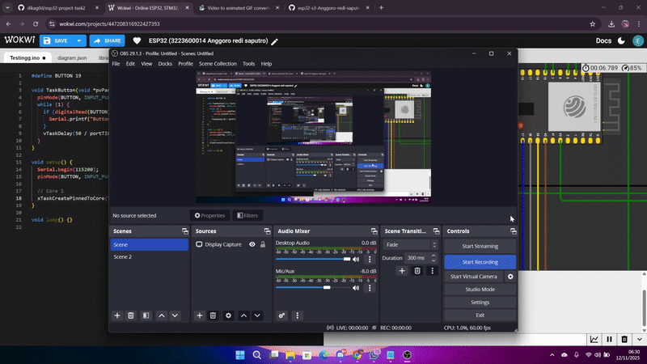

# Percobaan Button – FreeRTOS pada ESP32-S3

## Tujuan
Menguji pembacaan dua tombol secara bersamaan menggunakan dua task berbeda dengan prioritas tinggi.

---

## Konfigurasi Komponen
| Komponen | GPIO | Keterangan |
|-----------|------|------------|
| Button 1 | 19 | Input Pull-Up |
| Button 2 | 21 | Input Pull-Up |

---

## Alur Program
- **TaskButton1** dijalankan di **Core 1** dengan **prioritas 5**.  
- **TaskButton2** juga di **Core 1** dengan **prioritas 5**.  
Keduanya memantau status tombol setiap 50 ms dan mencetak hasil ke Serial Monitor.

---

## Hasil Percobaan

---

## Kesimpulan
- Prioritas tinggi memastikan respon cepat pada input pengguna.  
- Kedua tombol berfungsi simultan tanpa gangguan.

