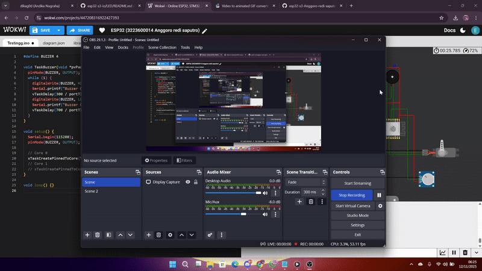

# Percobaan Buzzer – FreeRTOS pada ESP32-S3

## Tujuan
Percobaan ini bertujuan untuk menghasilkan bunyi buzzer secara periodik menggunakan FreeRTOS task tanpa menghambat proses lain.

---

## Konfigurasi Komponen
| Komponen | GPIO | Keterangan |
|-----------|------|------------|
| Buzzer | 4 | Output |

---

## Alur Program
1. **Inisialisasi Output**  
   Pin buzzer diatur sebagai output.

2. **Pembuatan Task Buzzer**  
   Task dijalankan pada Core 0 dengan **prioritas 1** agar tidak mengganggu task interaktif seperti tombol.

3. **Logika Bunyi**  
   Buzzer menyala 200 ms dan mati 1800 ms menggunakan `vTaskDelay()` (non-blocking).

---

## Hasil Percobaan

---

## Kesimpulan
- Task berprioritas rendah cukup untuk menghasilkan output periodik.  
- Delay non-blocking menjaga sistem tetap responsif terhadap task lain.
