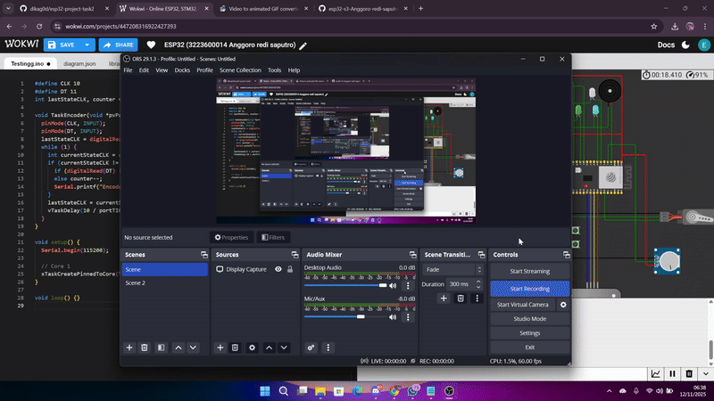

# Percobaan Encoder – FreeRTOS pada ESP32-S3

## Tujuan
Mendeteksi arah dan jumlah rotasi rotary encoder secara real-time menggunakan task FreeRTOS.

---

## Konfigurasi Komponen
| Komponen | GPIO | Keterangan |
|-----------|------|------------|
| Encoder CLK | 10 | Input |
| Encoder DT  | 11 | Input |

---

## Alur Program
- **TaskEncoder** dijalankan di **Core 1** dengan **prioritas 6**.  
- Membaca sinyal CLK & DT setiap 10 ms untuk menentukan arah putaran.  
- Mengupdate nilai counter ke Serial dan OLED.

---

## Hasil Percobaan

---

## Kesimpulan
- Prioritas menengah menjaga pembacaan encoder tetap cepat dan presisi.  
- Task lain tidak terganggu selama pembacaan data.

