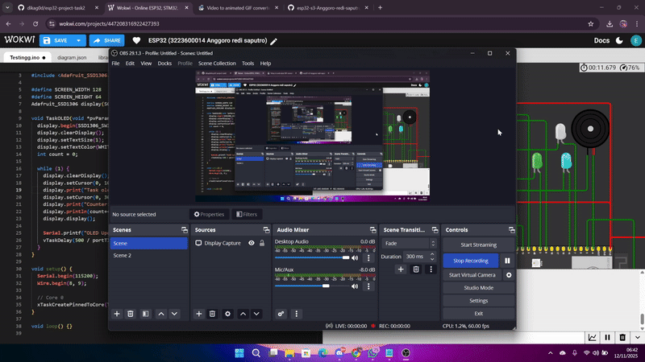

# Percobaan OLED – FreeRTOS pada ESP32-S3

## Tujuan
Menampilkan data potensiometer dan encoder ke layar OLED menggunakan komunikasi I²C dan task FreeRTOS.

---

## Konfigurasi Komponen
| Komponen | GPIO | Keterangan |
|-----------|------|------------|
| SDA | 8 | I2C Data |
| SCL | 9 | I2C Clock |

---

## Alur Program
- **TaskOLED** dijalankan di **Core 0** dengan **prioritas 8**.  
- Menampilkan nilai analog potensiometer dan counter encoder setiap 500 ms.  
- Menggunakan library Adafruit SSD1306 untuk pembaruan layar.

---

## Hasil Percobaan

---

## Kesimpulan
- Task berprioritas tertinggi memastikan pembaruan tampilan paling cepat.  
- Data sensor tampil real-time di OLED tanpa mengganggu task lain.

