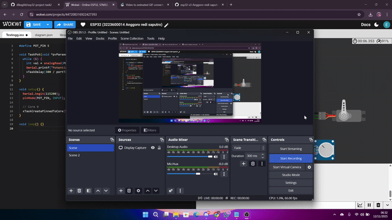

# Percobaan Potensiometer – FreeRTOS pada ESP32-S3

## Tujuan
Membaca sinyal analog dari potensiometer secara berkala dan menampilkan nilainya tanpa menghambat task lain.

---

## Konfigurasi Komponen
| Komponen | GPIO | Keterangan |
|-----------|------|------------|
| Potensiometer | 5 | Analog Input |

---

## Alur Program
- **TaskPot** dijalankan di **Core 0** dengan **prioritas 6**.  
- Membaca `analogRead(POT_PIN)` setiap 500 ms dan mengirim hasil ke Serial Monitor.

---

## Hasil Percobaan

---

## Kesimpulan
- Task dengan prioritas lebih tinggi dari LED & buzzer tetap membaca sinyal stabil.  
- Output analog terbaca dengan resolusi konstan di bawah multitasking.

