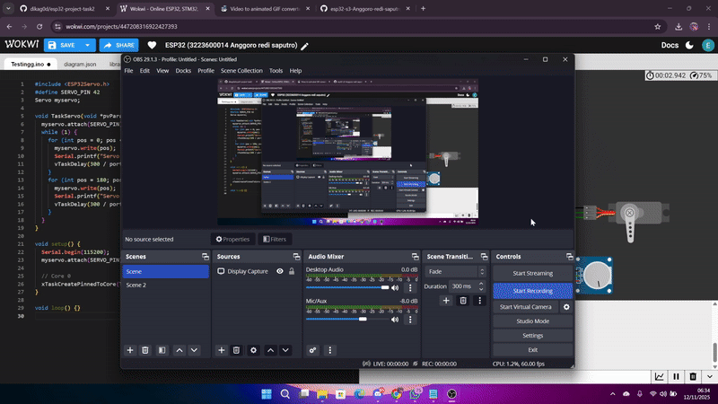

# Percobaan Servo – FreeRTOS pada ESP32-S3

## Tujuan
Menggerakkan servo motor dari 0° ke 180° lalu kembali menggunakan task FreeRTOS berprioritas tinggi.

---

## Konfigurasi Komponen
| Komponen | GPIO | Keterangan |
|-----------|------|------------|
| Servo Motor | 42 | PWM Output |

---

## Alur Program
- **TaskServo** dijalankan di **Core 0** dengan **prioritas 7**.  
- Servo bergerak bertahap setiap 10° dengan delay 100 ms antar langkah.  
- Menggunakan `vTaskDelay()` agar pergerakan tetap halus tanpa blocking.

---

## Hasil Percobaan

---

## Kesimpulan
- Prioritas tinggi menjamin servo tetap presisi dan lancar.  
- Task lain tetap berjalan karena delay tidak memblokir sistem.

