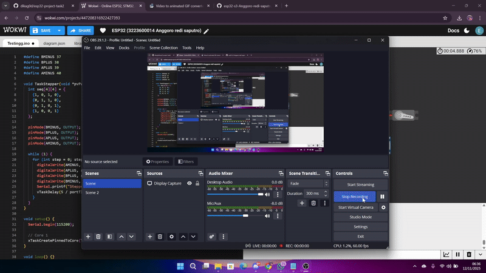

# Percobaan Stepper Motor – FreeRTOS pada ESP32-S3

## Tujuan
Mengontrol pergerakan motor stepper tanpa driver eksternal menggunakan task FreeRTOS.

---

## Konfigurasi Komponen
| Komponen | GPIO | Keterangan |
|-----------|------|------------|
| A- | 40 | Output |
| A+ | 39 | Output |
| B+ | 38 | Output |
| B- | 37 | Output |

---

## Alur Program
- **TaskStepper** dijalankan di **Core 1** dengan **prioritas 4**.  
- Task mengaktifkan urutan coil *full-step sequence* dengan delay 5 ms.  
- Rotasi berulang terus-menerus tanpa interupsi.

---

## Hasil Percobaan

---

## Kesimpulan
- Task berprioritas menengah menghasilkan rotasi stabil dan kontinu.  
- FreeRTOS dapat menjaga sinkronisasi antar task motor dan sensor.

